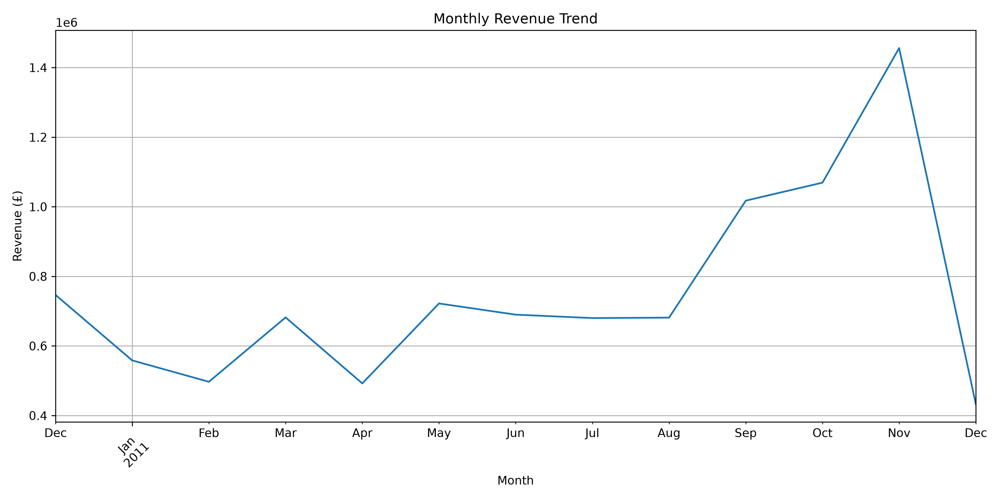
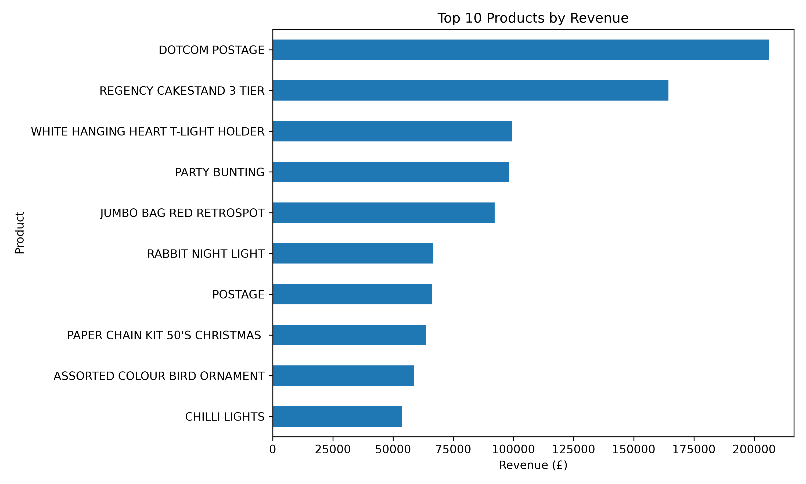
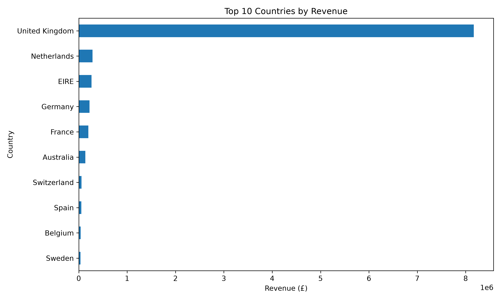
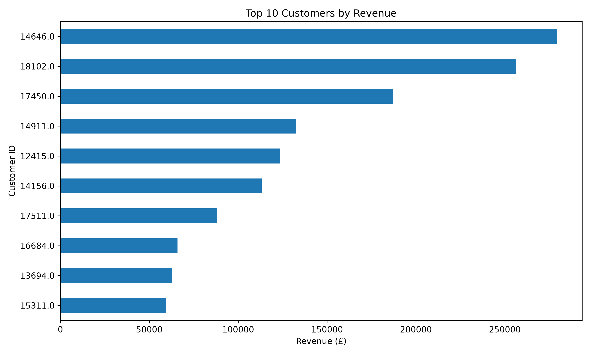
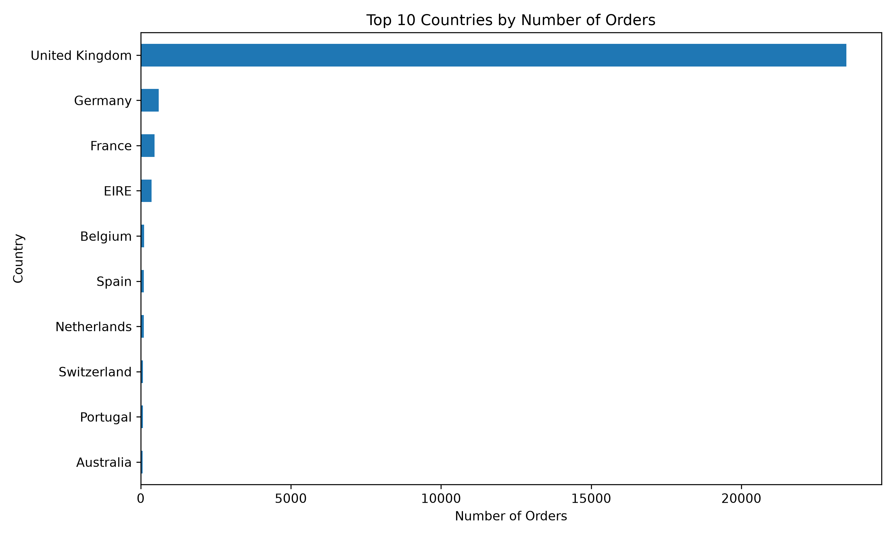
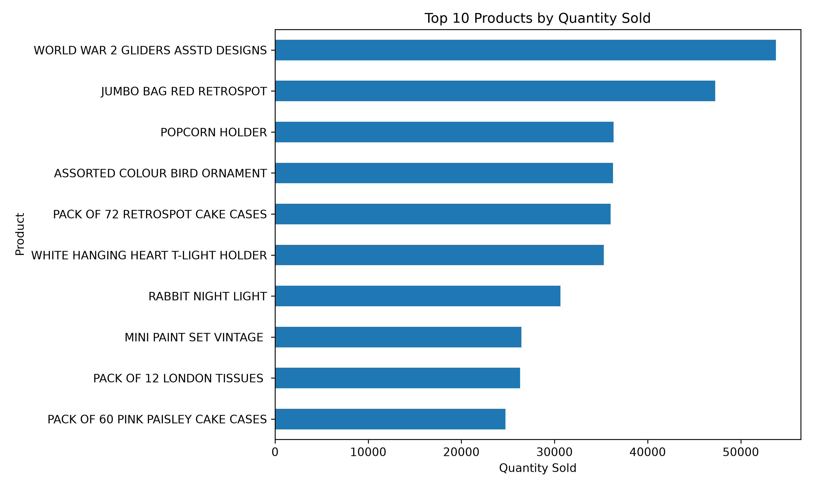
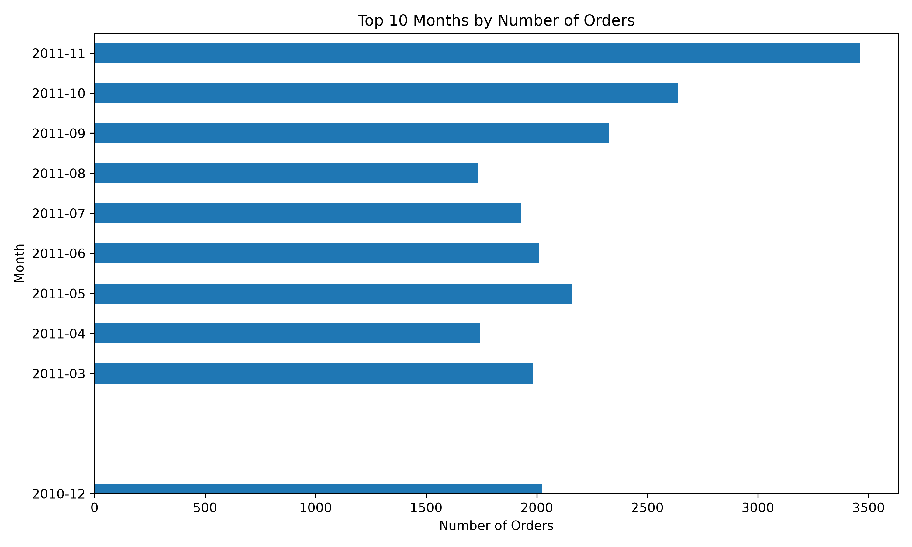
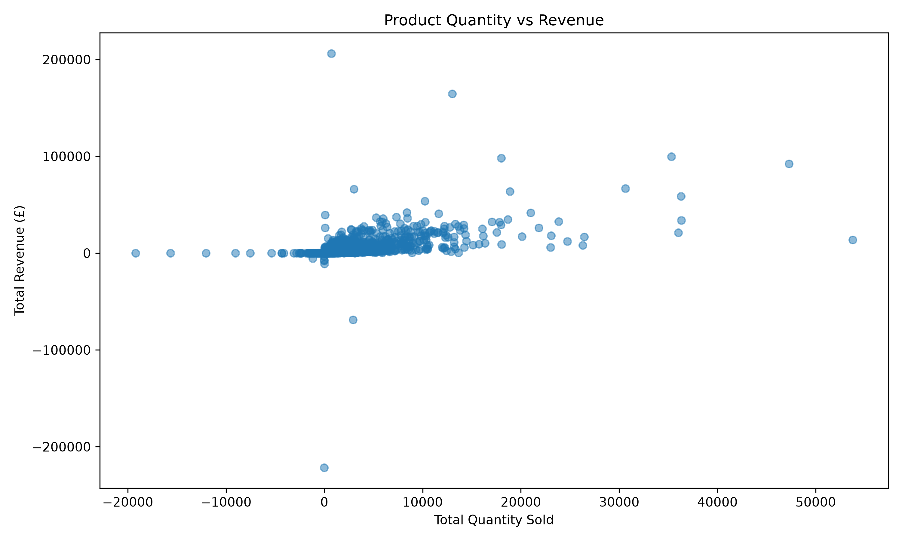

# E-Commerce Sales Data Analysis Using Python

## Project Overview

This project analyzes an e-commerce sales dataset using Python to understand
sales performance, customer behavior, product performance, geographic markets,
order trends, and cancellations.

The analysis uses data cleaning, data manipulation, statistical calculations,
and data visualization to generate meaningful business insights.

## Tools & Technologies

- Python
- Pandas
- NumPy
- Matplotlib
- Seaborn
- Jupyter Notebook
- Microsoft Excel Dataset

## Dataset

The project uses the Online Retail dataset containing transaction-level
e-commerce sales data.

### Dataset Features

- InvoiceNo — Invoice number
- StockCode — Product code
- Description — Product description
- Quantity — Quantity purchased
- InvoiceDate — Date and time of the transaction
- UnitPrice — Price per unit
- CustomerID — Customer identification number
- Country — Customer's country

## Business Questions

The analysis aims to answer the following business questions:

1. What is the total revenue generated from completed sales?
2. What is the average order value?
3. Which products generate the highest revenue?
4. Which products have the highest quantity sold?
5. Which countries generate the highest revenue?
6. Which countries have the highest number of orders?
7. Which customers contribute the most revenue?
8. Which months have the highest number of orders?
9. What is the cancellation rate?
10. How does product quantity relate to revenue?

## Key Analysis Results

| Metric | Result |
|---|---:|
| Gross Revenue | £10,619,986.68 |
| Completed Orders | 22,064 |
| Average Order Value | £481.33 |
| Cancelled Orders | 3,836 |
| Cancellation Rate | 14.81% |
| Net Revenue After Cancellations | £9,726,006.95 |

### Analysis Performed

- Monthly revenue trend analysis
- Top 10 products by revenue
- Top 10 products by quantity sold
- Top 10 countries by revenue
- Top 10 countries by number of orders
- Top 10 customers by revenue
- Cancellation and return analysis
- Product quantity vs. revenue analysis

## Visualizations

### Monthly Revenue Trend


### Top 10 Products by Revenue


### Top 10 Countries by Revenue


### Top 10 Customers by Revenue



### Top 10 Countries by Number of Orders



### Top 10 Products by Quantity Sold



### Top 10 Months by Number of Orders



### Product Quantity vs Revenue



## Project Workflow

The project follows these major steps:

1. Load the e-commerce dataset
2. Explore the dataset structure and statistics
3. Identify missing values and duplicate records
4. Clean and prepare the data
5. Create new features such as Revenue and Month
6. Analyze overall sales performance
7. Analyze monthly revenue and order trends
8. Analyze product performance
9. Analyze customer revenue contribution
10. Analyze country-wise sales and orders
11. Analyze cancellations and returns
12. Visualize important business metrics
13. Generate business insights from the analysis

## Business Insights

- Completed sales generated approximately £10.62 million in gross revenue.
- The average order value was approximately £481.33.
- A significant number of transactions were cancelled or returned, resulting in a cancellation rate of approximately 14.81%.
- Monthly analysis helps identify periods with higher sales activity and customer demand.
- Product-level analysis highlights products that contribute significantly to revenue and sales volume.
- Country-level analysis helps identify important geographic markets.
- Customer revenue analysis helps identify high-value customers.
- Product quantity versus revenue analysis helps understand the relationship between sales volume and revenue generation.

## Installation & Requirements

### Requirements

- Python 3.x
- Pandas
- NumPy
- Matplotlib
- Seaborn
- Jupyter Notebook
- OpenPyXL

### Installation

Clone the repository:

```bash
git clone <repository-url>
```

Navigate to the project folder:

```bash
cd python-sales-analysis
```

Install the required Python libraries:

```bash
pip install pandas numpy matplotlib seaborn jupyter openpyxl
```

### Run the Project

Open the Jupyter Notebook:

```bash
jupyter notebook
```

Then open:

```text
notebooks/sales_analysis.ipynb
```

## Conclusion

This project demonstrates how Python can be used to perform end-to-end
e-commerce sales data analysis.

The analysis covers data cleaning, feature engineering, sales analysis,
customer analysis, product analysis, country-wise analysis, order trends,
cancellation analysis, and data visualization.

The insights generated from the dataset can help businesses understand
sales performance, customer behavior, product demand, and market trends.

## Project Structure

```text
python-sales-analysis/
│
├── data/
│   └── Online Retail.xlsx
│
├── notebooks/
│   └── sales_analysis.ipynb
│
├── visualizations/
│   ├── monthly_revenue.png
│   ├── top_10_products_revenue.png
│   ├── top_10_products_quantity.png
│   ├── top_10_countries_revenue.png
│   ├── top_10_countries_orders.png
│   ├── top_10_customers_revenue.png
│   ├── top_10_months_orders.png
│   └── product_quantity_vs_revenue.png
│
├── test.py
└── README.md

## Author

**Yash Sachin Hole**

B.E. Computer Engineering  
Dattakala Group of Institutions Faculty of Engineering  
Savitribai Phule Pune University

Interested in Data Analytics and Business Analytics.

## Dataset Source

Dataset: Online Retail Dataset

Source: UCI Machine Learning Repository

The dataset contains transaction-level data from a UK-based online retail
business and is used for educational and analytical purposes.